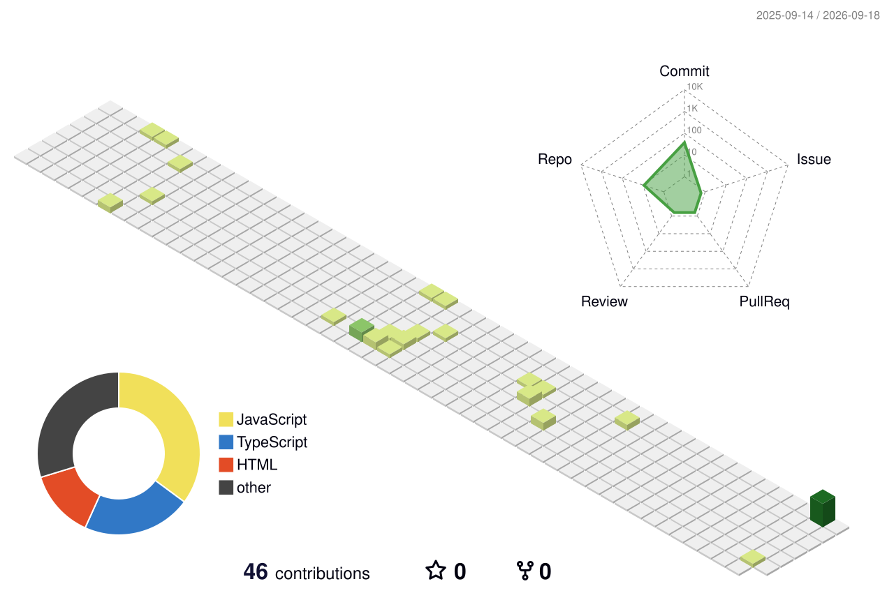

<div align="center">


### `COMPUTER SCIENCE STUDENT`  •  `WEB DEVELOPER`  •  `AI / ML ENTHUSIAST`

**Building useful things. Learning constantly. Shipping ideas.**

`CODE`  →  `LEARN`  →  `BUILD`  →  `IMPACT`

</div>

---

## `WHO AM I`

I'm **Tagore Nath Reddy**, a Computer Science student who enjoys turning ideas into working products. I'm especially interested in full-stack web development, AI/ML, hackathons, and solving practical problems with software.

```text
┌──────────────────────────────────────────────────────────────┐
│  CURRENT MODE                                                │
│                                                              │
│  > exploring      full-stack development                     │
│  > learning       artificial intelligence & machine learning │
│  > building       real-world projects                        │
│  > competing      hackathons                                 │
│  > improving      DSA + software engineering                  │
└──────────────────────────────────────────────────────────────┘
```

## 🧠 Currently Exploring

- 🌐 Full-stack web development
- 🤖 Artificial Intelligence & Machine Learning
- ⚡ Real-time systems and practical prototypes
- 🏆 Hackathons and innovation challenges
- 🧩 Data structures & problem solving

---

## 🛠️ Tech Stack

| Area | Technologies |
|---|---|
| **Languages** | Python • Java • JavaScript • HTML • CSS |
| **Frontend** | React • Tailwind CSS |
| **Backend** | Node.js • Express • Socket.IO |
| **Database** | MongoDB |
| **AI / Data** | NumPy • Pandas • Scikit-learn |
| **Tools** | Git • GitHub • VS Code |

---

## 🚀 Featured Projects

### ⚡ Virtual Battery Pool
**Dynamic Physics-Informed Micro-Grid Balancing**

A concept for aggregating flexible electricity loads into a virtual battery pool to help balance renewable-energy fluctuations.

**Focus:** Energy • Optimization • Smart Grids • AI/ML

→ [`Virtual-Battery-Pool`](../Virtual-Battery-Pool)

### 🛕 Temple Crowd Management System

A real-time crowd-management and visualization system for temples and heritage sites, featuring crowd-density visualization, an admin dashboard, visitor booking, crowd prediction, and real-time updates. The project uses React, Tailwind CSS, D3.js, Chart.js, Node.js, Express, Socket.IO and MongoDB. fileciteturn5file0L2-L2

**Focus:** Real-time Systems • Data Visualization • Prediction • Full Stack

→ [`Temple-Heritage-site-crowd-controlling-simulation-model`](../Temple-Heritage-site-crowd-controlling-simulation-model)

### 💻 More Projects

I also build projects around web development, AI/ML, security, cloud systems and hackathon problem statements.

→ [`Explore my repositories`](../)

---

## 📊 GitHub Activity

<div align="center">

### `3D CONTRIBUTION MATRIX`



</div>

> The 3D contribution visualization is generated automatically by GitHub Actions and refreshed daily.

---

## 🎯 2026 Mission

```text
[████████████████░░░░] Build real-world projects
[██████████████░░░░░░] Improve DSA & problem solving
[████████████░░░░░░░░] Deepen AI / ML skills
[██████████░░░░░░░░░░] Contribute to Open Source
[████████░░░░░░░░░░░░] Ship a production-level application
```

---

## 🌌 Developer Mindset

```text
┌─────────────────────────────────────────────┐
│                                             │
│   THINK  →  BUILD  →  BREAK  →  LEARN      │
│                  ↓                          │
│                IMPROVE                      │
│                  ↓                          │
│                 SHIP                        │
│                                             │
└─────────────────────────────────────────────┘
```

> **Small consistent progress leads to big results.**

---

<div align="center">

### 💻 Build. Break. Learn. Repeat.

`Thanks for visiting my profile.` 🚀

</div>
