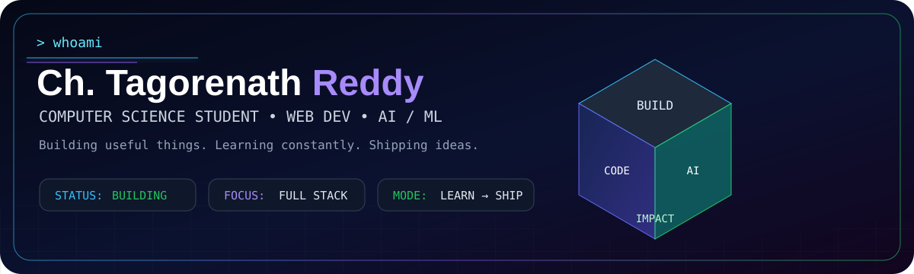

### Computer Science Student · Web Developer · AI/ML Enthusiast

**I enjoy building practical software and turning ideas into working products.**

 

---

## 👋 About Me

I'm **Tagore Nath Reddy**, a Computer Science student interested in building useful products with modern software technologies.

- 🔭 Currently building **Virtual Battery Pool**
- 🌱 Learning **full-stack development, AI/ML and DSA**
- 🏆 Interested in **hackathons and real-world problem solving**
- 💡 I enjoy learning by building and experimenting

---

## 🛠️ Tech Stack

**Languages**  
    

**Web & Backend**  
    

**AI / Data**  
  

**Tools**  
  

---

## 🚀 Featured Projects

### ⚡ [Virtual Battery Pool](https://github.com/tagore189/Virtual-Battery-Pool)

A smart-grid concept that coordinates flexible electricity loads as a virtual energy resource to help balance renewable-energy fluctuations.

**Focus:** Smart Grids · Optimization · Energy Systems

### 🛕 [Temple Heritage Site Crowd Management](https://github.com/tagore189/Temple-Heritage-site-crowd-controlling-simulation-model)

A real-time crowd-management and visualization system for temples and heritage sites, featuring crowd-density visualization, visitor booking, prediction, an admin dashboard and Socket.IO updates.

**Stack:** React · Tailwind CSS · D3.js · Chart.js · Node.js · Express · Socket.IO · MongoDB

### 💻 [CodeClash](https://github.com/tagore189/CodeClash)

A coding-focused project built around programming and problem solving.

### 🌐 [My Portfolio](https://github.com/tagore189/My-Portfolio)

My personal portfolio project and a place to showcase my work.

---

## 📈 GitHub Stats

&nbsp;&nbsp;

---

## 🎯 2026 Goals

- Build and deploy production-quality projects
- Improve DSA and problem-solving skills
- Go deeper into AI/ML
- Contribute to open source
- Participate in more hackathons
- Build software that solves real problems

---

## 🤝 Let's Connect

  

<i>Build something useful. Learn something new. Repeat.</i> 🚀

